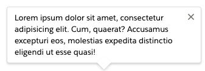
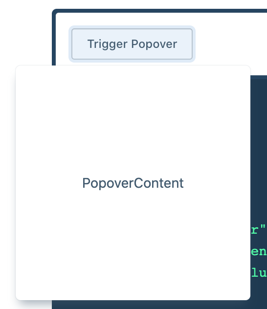
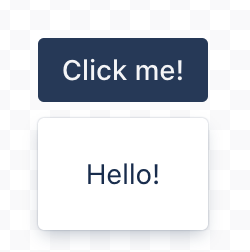
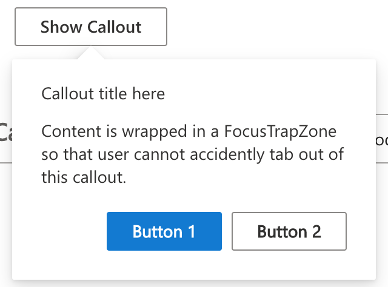

# Flyout
## Overview
Flyout is a focusable floating container that shows over a pages content and displays UI related to what the user is doing. It is typically triggered by a clickable element. Similar to a Dialog, but with positioning controls, no overlay option, and no specific action being required, a Flyout can be used to reveal a secondary control or show more detail about an item.

### Background
A Flyout can be less intrusive to the user experience than a Dialog. It should be used instead of a Dialog when information or input is needed to be displayed, but not in the center of the screen, such as in the case of collection of additional info before an action, or displaying information that is only relevant some of the time.

### Use Cases
- As a popup showing additional info for an item on the page.
- To display a larger image of a thumbnail image in a photo gallery.
- To display an action related to a page item.

### Features
**Placement Logic:** - This component will use *Anchored Region* to be positioned relative to the Flyout target element. This way it can be dynamic and adapt to the available space.

**Soft Dismiss (aka Light Dismiss):** - A way to quickly close the Flyout by clicking outside it, or pressing the `esc` key. An event would be emitted anytime the Flyout is dismissed. The Flyout would always be soft-dismissable. Detecting the users next click of a different element can trigger this when clicking outside the Flyout.

**Focus Management:** - Should follow the same process for focus management as a Dialog, primarily as the Flyout's role will be 'dialog'.

This includes:
- Trap focus - optional, defaults to enabled - Focus is contained within the Flyout while it is visible.
- First element focus - Focusing on the first focusable element when trap focus is enabled, but not overriding an element that is set to be focused by the author.
- Returning focus to the target - after Flyout is closed the focus would return to the target element per the expectations of the Dialog design pattern.

### Risks and Challenges
Trap focus in the shadowDom has risk as it can be problematic and the FAST teams is currently re-evaluating how this is accomplished.
For more insight: [Managing focus in the shadow DOM](https://nolanlawson.com/2021/02/13/managing-focus-in-the-shadow-dom/)


### Prior Art/Examples

#### Popover from Salesforce
- https://www.lightningdesignsystem.com/components/popovers/


#### Popover from Evergreen
- triggered by a button
- https://evergreen.segment.com/components/popover/



#### Microsoft Windows Developer Flyout, Text Only


#### Microsoft Windows Developer Flyout, Actionable


#### Inline Dialog from ATLAssian
- https://atlassian.design/components/inline-dialog/examples



#### Callout with actions from Fluent UI
- https://developer.microsoft.com/en-us/fluentui#/controls/web/callout



---

### API
*Component Name*
- `fast-flyout`

*Attributes*
- `hidden` - boolean, whether or not the flyout is hidden (defaults to false).
- `trap-focus` - boolean, whether or not to keep focus contained inside the Flyout, defaults to true
- `target` - string, the html id of the HTMLElement that the Flyout is attached to, (viewport for anchored region defaults to the parent of the anchor) and triggered by
- `position` - enum, where the tooltip should appear relative to its target, uses Anchored Region logic, see *Position Options*
- `delay` - number, milliseconds (ms) the time delay before the Flyout is shown once triggered
- `aria-labelledby` - optional based on implementation**
- `aria-describedby` - optional based on implementation**
- `aria-label` - optional, based on implementation**

    ** See the [W3C Specification](https://w3c.github.io/aria-practices/#dialog_roles_states_props) for requirements and details.

*Properties*
- `targetElement` - the reference to the HTMLElement used as target
- `viewportElement` - the reference to the HTMLElement used as the viewport, required to set up anchored region properly
- `flyoutVisible` - boolean, whether or not the Flyout is visible, for use inside the controller without changing exposed `hidden` attribute

*Slots*
- default for content

*Events*
- `dismiss` - event fired when the Flyout is dismissed

*Functions*
- `createFlyoutTemplate(string: prefix)` - generates a `ViewTemplate` for the Flyout based on the given provided prefix string. This is required as Flyout uses an `anchored-region` internally and the create function generates a template using the appropriate `anchored-region` tag (ie "fast-anchored-region", "fluent-anchored-region"). Note that the appropriate `anchored-region` component must also be declared.

*Position Options*

- above-centered, below-centered


- right-centered, left-centered


- top-left-corner, top-right-corner, bottom-right-corner, bottom-left-corner


- above-left-aligned, below-left-aligned


- above-right-aligned, below-right-aligned


- left-top-aligned, right-top-aligned


- left-bottom-aligned, right-bottom-aligned


### Anatomy and Appearance
Parts:
- `flyout` - the Flyout itself, has `role=dialog`
- `anchored-region` - the anchored region that controls the position of the Flyout


*Template:*
**ASK (2)**
```html
export function createFlyoutTemplate(prefix: string): ViewTemplate {
    return html<Flyout>`
        ${when(
            x => !x.hidden,
            html<Flyout>`
                <${prefix}-anchored-region
                    anchor="${x => x.targetElement}"
                    vertical-positioning-mode="dynamic"
                    horizontal-positioning-mode="dynamic"
                    horizontal-default-position="${x => x.getHorizontalPosition()}"
                    vertical-default-position="${x => x.getVerticalPosition()}"
                    horizontal-inset="${x => x.getHorizontalInset()}"
                    vertical-inset="${x => x.getVerticalInset()}"
                    ${ref("anchoredRegion")}
                >
                    <div
                        class="content"
                        part="content"
                        role="dialog"
                    >
                        <slot></slot>
                    </div>
                </fast-anchored-region>
            `
        )}
    `;
}
```

---

## Implementation
```html
<fast-flyout>
    <p>This is a flyout</p>
    <fast-button>Action</fast-button>
</fast-flyout>
```

### States
`hidden` - The dialog is hidden. This state is managed solely by the app author via the hidden attribute. The default for this is `false`.

### Accessibility
*Keyboard Navigation and Focus*
Keyboard and navigation will follow the same rules as Dialog per the [W3C Specification](https://w3c.github.io/aria-practices/#dialog_modal), except when there is no focusable content then the Flyout itself will receive focus.

### Globalization
The component visuals should change when in RTL scenarios as the component is positioned relative to its target.

### Dependencies
This component should be positioned using [anchored region](../packages/web-components/fast-foundation/src/anchored-region/anchored-region.spec.md).

## Resources
[W3C Specification](https://w3c.github.io/aria-practices/#dialog_modal)
[Flyout Menus](https://www.w3.org/WAI/tutorials/menus/flyout/#flyoutnavmousefixed)
[Dialogs and Flyouts](https://docs.microsoft.com/en-us/windows/uwp/design/controls-and-patterns/dialogs-and-flyouts/#:~:text=A%20flyout%20is%20a%20lightweight%20contextual%20popup%20that,control%20or%20show%20more%20detail%20about%20an%20item.)
